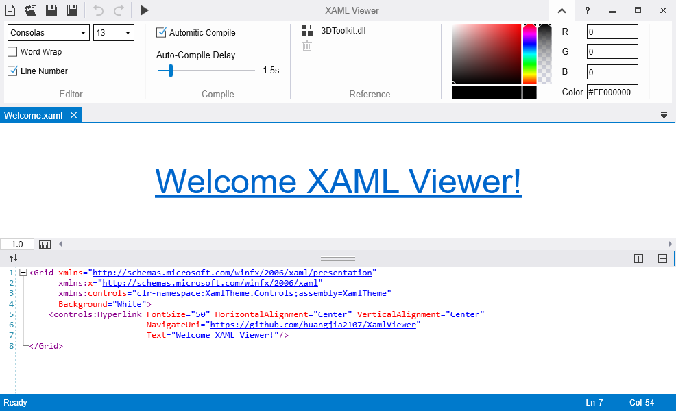

# XAML Viewer

XAML Viewer是一款轻量级的XAML编辑器。在编写文本的同时，能够实时显示相应的设计预览。不仅提供方便的文档管理，更具人性化的智能提示。当你在学习或尝试一些XAML效果时，一定会是你的不错选择。

XAML is a lightweight XAML Editor.
While coding, the corresponding design preview can be displayed in real time.Providing convenient doc management, and more user-friendly intelligent tips.
When you are learning or trying out some XAML effects, it's a pretty good choice for you.



## Document Manager  
1. 支持新建，打开，保存，关闭，拖动等操作；
2. 支持预览与编辑面板位置交换操作；
3. 支持在Active Files下拉列表中针对已打开的文件进行快速选择。  

_注意：在关闭软件时，只会自动保存已经存储在本地的文档，请务必在此之前，将需要保留的临时文档保存到本地。_

## 
1. Support operations:new, open, save, close, drag and etc.;
2. Support operations:switch preview and edit panel;
3. Support quick-selection for opened file in drag-down list.

_Notice：Only local doc files could be saved when closing the software. Please make sure doc files had been saved in local path._

## Automitic Compilation
1. Auto-Compile，开启或关闭自动编译功能，但手动编译[F5]，一直生效；
2. Auto-Compile Delay，在无任何输入的指定时间后自动执行编译。

##
1. Auto-Compile:Enable/disable Auto-Compile function; While compile manually [F5] always takes effect;
2. Auto-Compile Delay:To compile automatically after "Auto-Compile Delay" time while idle(no input).

## Reference
1. [Setting] >> [Reference] >> [Add]: 添加自定义控件库，可以在XAML中直接引用其中控件；
2. 当前软件基于.Net Framework 4.5，只要系统中包含.Net Framework 4.X（X >= 5），即可引用基于4.0--4.X任意版本的控件库；
3. 引用自定义控件库时，请按照以下形式声明命名空间：</br>
``` xml
xmlns:controls="clr-namespace:MyControl.Controls;assembly=MyControl"
```
##
1. [Setting] >> [Reference] >> [Add]: To add customized component library, which could be called directly in XAML;
2. The software is based on .Net Framework 4.5.All component libraries based on 4.0-4.X could be referenced as long as .Net Framework 4.X(X>=5) is installed in the system;
3. Please declare name space as the following form:</br>
``` xml
xmlns:controls="clr-namespace:MyControl.Controls;assembly=MyControl"
```

## Third-Party Notices
Library|Version|License
--|:--:|--:
[Prism](https://github.com/PrismLibrary/Prism)|7.2.0.1422|[MIT](https://github.com/PrismLibrary/Prism/blob/master/LICENSE)
[Microsoft.Xaml.Behaviors](https://github.com/microsoft/XamlBehaviorsWpf)|1.1.19|[MIT](https://github.com/microsoft/XamlBehaviorsWpf/blob/master/LICENSE)
[AvalonEdit](https://github.com/icsharpcode/AvalonEdit)|6.0.1|[MIT](https://github.com/icsharpcode/AvalonEdit/blob/master/LICENSE)
[Json.NET](https://github.com/JamesNK/Newtonsoft.Json)|12.0.3|[MIT](https://github.com/JamesNK/Newtonsoft.Json/blob/master/LICENSE.md)
                   
