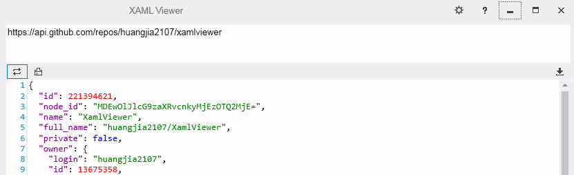
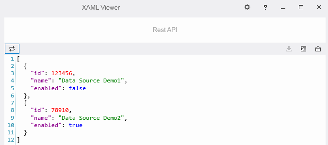

# XAML Viewer
XAML is a lightweight XAML Editor.
While coding, the corresponding design preview can be displayed in real time.Providing convenient doc management, and more user-friendly intelligent tips.
When you are learning or trying out some XAML effects, it's a pretty good choice for you.


## Build
1. [.Net Core 3.1 SDK and .Net Framework 4.5 Dev Pack](https://dotnet.microsoft.com/download);
2. [Visual Studio Code or Visual Studio 2019](https://visualstudio.microsoft.com/);
3. Windows 7 SP1/8/8.1/10

_Notice：You can adjust the TargetFrameworks in the Directory.Build.props file according to your needs._

## Document Manager
1. Support operations: new, save, open, close, drag and etc.;
2. Support quick-selection for opened file in Active Files drop-down list.

_Notice：Only local doc files could be saved when closing the software. Please make sure doc files had been saved in local path._

## Automitic Compilation
1. Auto-Compile: Enable/disable Auto-Compile function, While compile manually [F5] always takes effect;
2. Auto-Compile Delay: To compile automatically after "Auto-Compile Delay" time while idle(no input).

## Reference
1. [Setting] >> [Reference] >> [Add]: To add custom control library, which could be called directly in XAML;
2. Please declare namespace as the following form:</br>
``` csharp
xmlns:controls="clr-namespace:MyControl.Controls;assembly=MyControl"
```
## Data Source
### 1. Object


``` xml
<TextBlock Text="{Binding owner.login}"/>
```
### 2. Array


``` xml
<ItemsControl ItemsSource="{Binding .}">
    <ItemsControl.DataTemplate>
        <TextBlock Text="{Binding tag_name}"/>
    </ItemsControl.DataTemplate>
</ItemsControl>
```
## Third-Party Notices
Library|Version|License
--|:--:|--:
[Prism](https://github.com/PrismLibrary/Prism)|7.2.0.1422|[MIT](https://github.com/PrismLibrary/Prism/blob/master/LICENSE)
[Microsoft.Xaml.Behaviors](https://github.com/microsoft/XamlBehaviorsWpf)|1.1.19|[MIT](https://github.com/microsoft/XamlBehaviorsWpf/blob/master/LICENSE)
[AvalonEdit](https://github.com/icsharpcode/AvalonEdit)|6.0.1|[MIT](https://github.com/icsharpcode/AvalonEdit/blob/master/LICENSE)
[Json.NET](https://github.com/JamesNK/Newtonsoft.Json)|12.0.3|[MIT](https://github.com/JamesNK/Newtonsoft.Json/blob/master/LICENSE.md)
                   
